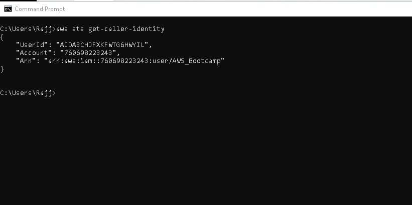

This Article is published based on the **AWS Cloud Project Bootcamp** by Andrew Brown

https://www.youtube.com/watch?v=8b8SvQHc4Pk&list=PLBfufR7vyJJ7k25byhRXJldB5AiwgNnWv

The Bootcamp mainly covers on a Project "Cruddur" a Micro-blogging application

### **Prerequisites**

You'll need to register following services to fulfill the project implementation:
- Create a [Github Account](https://github.com/): Source code repository and versioning tool
- Create a [Gitpod account](https://www.gitpod.io/): Gitpod is a cloud development environment for teams to efficiently and securely develop software. add Gitpod add-in as an extension to your browser
- Create [Github CodeSpace](https://github.com/features/codespaces) A codespace is a development environment that's hosted in the cloud.  
- Create the [AWS](https://aws.amazon.com/) account : Amazon Web Services offers reliable, scalable, and inexpensive cloud computing services. 
 **Note:**  Requires credit card validation to create AWS free account which is valid for 12 months
- Create [Lucidchart](https://www.lucidchart.com/) account: Lucidchart is a web-based diagramming application that allows users to visually collaborate on drawing, revising and sharing charts and diagrams, and improve processes, systems, and organizational structures 
- Create [Honeycomb](https://www.honeycomb.io/) account: Honeycomb is a software debugging tool that can help you solve problems faster within your distributed services 
- Create [Rollbar](https://app.rollbar.com/onboarding) account.


# Week 0 - Billing and Architecture

## Billing


## Architecture Diagram

Following images shows the Architecture of the **"Cruddur - Micro-Blogging application"**


[Cruddur Logical Diagram Link](https://lucid.app/lucidchart/82424ea2-6bf4-4f97-a989-6fc494cfdd1f/edit?viewport_loc=-104%2C320%2C2220%2C972%2C0_0&invitationId=inv_4964519e-18db-4a59-8401-97d0305a9e32)

### Installation & Verification of AWS CLI
I have followed [AWS CLI installation](https://docs.aws.amazon.com/cli/latest/userguide/getting-started-install.html) documentation

I have installed the AWS CLI in Local machine from Command Prompt  by using following command 
```
msiexec.exe /i https://awscli.amazonaws.com/AWSCLIV2.msi
```


After successfull installation I've checked for AWS version but then I"ve faced an error that AWS was not installed.


Later I've fxed the issue by closing and reopening the command prompt

### Configuration of Access key to CLI

I've logged in AWS console and enabled Console access under **Security Credentials** for IAM User


I've created Access Key for user using AWS Console and configured in command prompt using following command
```
AWS configure
```
Entered Access key, Secret Key, Location as us-east-1 generated from AWS Console.

I've verified the Account details of configured Access key using following command in **Command prompt** 
```
aws sts get-caller-identity
```



